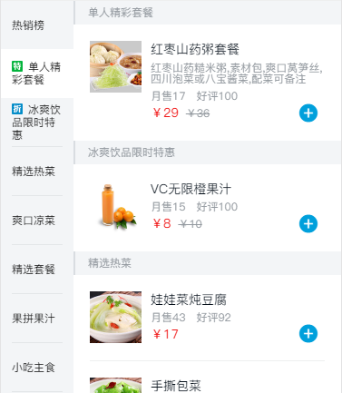

# 列表联动以及小球动画

## 商品列表联动



``` html
  <!-- 基本DOM结构 -->
  <div class="goods">
    <!-- 商品分类列表 -->
    <div class="menu-wrapper" ref="menuWrapper">
      <ul>
        <li class="menu-item" ref="menuList" @click="selectMenu(index, $event)">商品单个分类标题</li>
      </ul>
    </div>
    <!-- 商品列表 -->
    <div class="foods-wrapper" ref="foodsWrapper">
      <ul>
        <li class="food-list" ref="foodList">
          <h1>商品单个分类标题</h1>
          <ul>
            <li>分类下商品</li>
          </ul>
        </li>
      </ul>
    </div>
  </div>
```

``` json
  // 简易版数据
  {
    "goods": [
      {
        "name": "热销榜",
        "type": -1,
        "foods": [
          {
            "name": "皮蛋瘦肉粥",
            "price": 10,
            "oldPrice": "",
            "description": "咸粥",
            "sellCount": 229,
            "rating": 100,
            "icon": "http://fuss10.elemecdn.com/c/cd/c12745ed8a5171e13b427dbc39401jpeg.jpeg?imageView2/1/w/114/h/114",
            "image": "http://fuss10.elemecdn.com/c/cd/c12745ed8a5171e13b427dbc39401jpeg.jpeg?imageView2/1/w/750/h/750"
          },
          ...
        ]
      },
      ...
    ]
  }
```

+ 引入 `better-scroll` : `import BScroll from 'better-scroll'`
+ 获取数据之后，初始化 商品分类列表 与 商品列表。并监听商品列表的滚动，记录Y轴的滚动值 scrollY，主要用于获取在 商品列表下，商品分类标题距离容器顶部距离的数组（listHeight） 中的 index。从而在商品分类列表下，找到对应的 DOM，并滚动到对应 DOM

  ``` javascript
    _initScroll () {
      // 商品分类列表
      this.menuScroll = new BScroll(this.$refs.menuWrapper, {
        click: true
      })
      // 商品列表
      this.foodsScroll = new BScroll(this.$refs.foodsWrapper, {
        click: true,
        probeType: 3
      })
      // 监听商品列表滚动，并记录Y轴的滚动距离
      this.foodsScroll.on('scroll', (pos) => {
        // pos.y <= 0，判断滑动方向，避免下拉时分类高亮错误（如:第一个分类商品数量为1时，下拉使得第二分类高亮）
        if (pos.y <= 0) {
          this.scrollY = Math.abs(Math.round(pos.y))
          // pos.y 为负值，需要通过 Math.abs() 取正数
          // Math.round() 方法可把一个数字舍入为最接近的整数; Math.abs() 方法可返回数的绝对值
        }
      })
    }
  ```

+ 同时，将各个商品分类标题距离容器顶部的高度形成一个数组 listHeight，主要用于为商品列表滚动的距离（scrollY），获取对应商品分类的index

  ``` javascript
    _calculateHeight () {
      let foodList = this.$refs.foodList // 获取商品列表下，商品分类标题的DOM数组
      let height = 0 // 商品列表下，第一个分类标题距离容器内顶部的距离为 0
      this.listHeight.push(height)
      for (let i = 0; i < foodList.length; i++) {
        let item = foodList[i]
        height += item.clientHeight // clientHeight 元素内部高度，包含内边距，但不包括水平滚动条、边框和外边距
        this.listHeight.push(height)
      }
    }
  ```

+ 设置计算属性 currentIndex（用于与商品分类列表相联动的）。当商品滚动时，scrollY 发生变化，此时判断 scrollY 在哪个商品分类距离区间内。同时，调用 _followScroll，传递 index 值，触发滚动商品分类列表，到指定的分类下。同时，currentIndex 通过绑定 class，可以通知对应分类的高亮

  ``` javascript
    // computed 计算属性
    currentIndex () {
      for (let i = 0; i < this.listHeight.length; i++) {
        let height1 = this.listHeight[i]
        let height2 = this.listHeight[i + 1]
        // height1 - height2 为对应分类的区间
        // 当食品列表滚动的高度在 [height1, height2]区间 内则返回对应的 i
        // 如果 i 为最后一个，i + 1则超出 listHeight数组的长度，height2 为 undefined
        // 需要对 height2 进行判断，如果 i 为最后一个，或者在 [height1, height2] 区间，则返回 i
        if (!height2 || (this.scrollY >= height1 && this.scrollY < height2)) {
          this._followScroll(i)
          return i
        }
      }
      return 0
    }

    // methods 方法
    _followScroll (index) {
      let menuList = this.$refs.menuList
      let el = menuList[index]
      this.menuScroll.scrollToElement(el, 300, 0, -100)
    }
  ```

+ 当用户点击商品分类列表中的单个商品分类时，触发 selectMenu() 方法，传递对应的分类index，获取商品列表下的商品分类数组，滚动到对应商品分类DOM

  ``` javascript
    selectMenu (index, event) {
      // 当页面切换为PC端模式的时候，点击事件会触发两次
      // better-scroll 设置 click:true 的时候，会派发一个点击事件，在PC端页面原生点击事件也可以被监听到
      // 针对better-scroll的事件,事件 event 中有属性 _constructed 进行标识，为 true 时，表示为 better-scroll 的派发事件
      // 原生事件中没有属性 _constructed
      // 在 PC 端通过  _constructed 标识将 better-scroll 派发的事件禁用，使用原生事件
      if (!event._constructed) {
        return
      }
      let foodList = this.$refs.foodList
      let el = foodList[index]
      this.foodsScroll.scrollToElement(el, 300)
    },
  ```